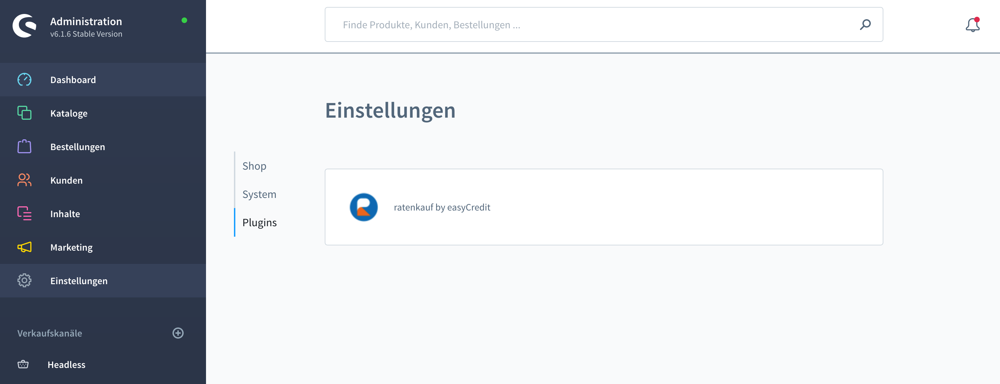
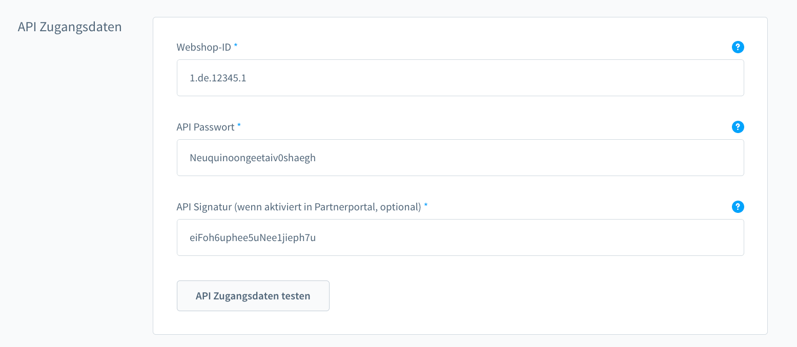
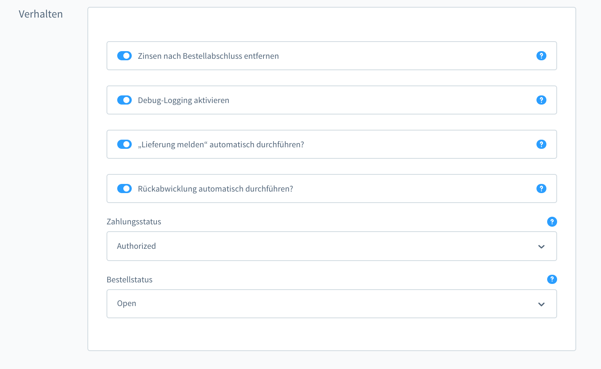
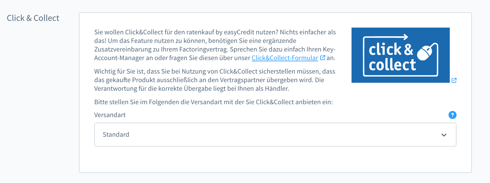
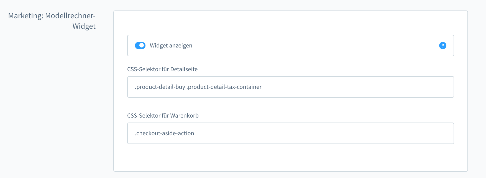
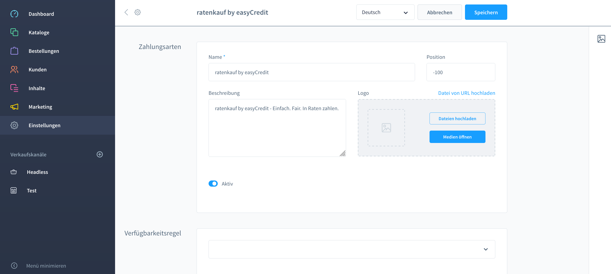

.. role:: latex(raw)
   :format: latex

.. _configuration:

Konfiguration
=============

Nachdem Sie die Installation erfolgreich abgeschlossen haben, konfigurieren Sie das Plugin. Damit das Plugin als Zahlungsmethode angezeigt wird, aktivieren Sie easyCredit-Ratenkauf und easyCredit-Rechnung als Zahlungsmethoden für den deutschen Store.

Konfigurations Menü öffnen
--------------------------

Zur Konfiguration öffnen Sie in der Administration den Bereich :menuselection:`Erweiterungen --> Meine Erweiterungen`. In der Liste der installierten Plugins sollte nun **easyCredit-Rechnung & Ratenkauf für Shopware 6** enthalten sein.
In dieser Zeile klicken Sie einfach auf das Plugin um die Konfiguration zu öffnen.

Plugin konfigurieren
--------------------

Die Konfigurationsmöglichkeiten sind im Folgenden gezeigt. Als Mindestkonfiguration geben Sie hier Ihre Webshop-Id und Ihr API-Passwort an.

API-Zugangsdaten
~~~~~~~~~~~~~~~~~

Hier geben Sie die API-Zugangsdaten ein. Diese bestehen aus der Webshop-ID (1.de... / 2.de...) und Ihrem Passwort, dass Sie im Partner-Portal festlegen können.

.. note:: Nach einem erfolgreichen Test der API-Zugangsdaten, vergessen Sie bitte nicht auf **Speichern** zu klicken.

API-Signatur (optional, ab v2.0.0)
**********************************

Ab v2.0.0 des Plugins besteht die Möglichkeit die API-Kommunikation mit einer Signatur zu versehen. Die API-Kommunikation wird dann signiert und kann im Shop gegen die Signatur geprüft werden. Erstellen Sie hierzu im Partner-Portal eine API-Signatur und aktivieren Sie diese ebenfalls im Partner-Portal. Tragen Sie die API-Signatur im Backend Ihres Shops-Systems ein und prüfen Sie die Zugangsdaten. Die Prüfung der Zugangsdaten berücksichtigt die API-Signatur und ist bei aktivierter Signatur nur erfolgreich, wenn der Signatur-Schlüssel übereinstimmt.

Verhalten
~~~~~~~~~~~

Im Bereich *Verhalten* kann das Verhalten des Plugins beinflusst werden. Die einzelnen Optionen sind bei Hover über das Info-Icon näher erläutert oder im Folgenden konkretisiert. 

Zinsen nach Bestellabschluss entfernen
***************************************

Der Ratenkauf erfordert die Anzeige der Zinsen während des Bezahlvorganges sowie die Einbeziehung der Zinsen in die Gesamtsumme der Bestellung in der Kundenkommunikation. Darum fügt das Plugin automatisch die Position *Zinsen für Ratenzahlung* im Bestellvorgang ein. Möglicherweise ist diese Position im weiteren Verarbeitungsprozess aber nicht mehr erwünscht. Mit dieser Option werden die Zinsen aus der Bestellung entfernt und in der Administration nicht mehr angezeigt, was zu einer Vereinfachung des Prozesses u.a. mit Warenwirtschaftssystemen führt.

Debug-Logging 
****************************

Um das Verhalten des Plugins und die API-Kommunikation zu analysieren, kann diese Einstellung aktiviert werden. Das Plugin loggt bei aktivierter Option die Kommunikation in *var/log/netzkollektiv_easycredit_prod-[Y]-[m]-[d].log*

Zahlungs- und Bestellstatus
****************************

Der Zahlungs- und Bestellstatus, den eine mit easyCredit getätigte Bestellung initial erhält, kann mit dieser Option eingestellt werden. Es werden hier nur die Status angezeigt, die für eine offene Bestellung entsprechend des Statusüberganges (*State Machine Transitions*) zur Verfügung stehen. Wird hier keine Auswahl getroffen oder "Offen" gewählt erfolgt keine Veränderung des Status.

Click & Collect
~~~~~~~~~~~~~~~~~~

Um *Click & Collect* für eine Versandart zu aktivieren, kann diese als *Click & Collect*-Versandart ausgewählt werden. Wählt der Kunde diese Versandart im Bezahlvorgang aus, wird dies bei der Finanzierungsanfrage entsprechend übertragen. Weitere Informationen finden Sie unter `Click & Collect <https://www.easycredit-ratenkauf.de/click-und-collect/>`_

Marketing: Ratenrechner-Widget
~~~~~~~~~~~~~~~~~~~~~~~~~~~~~~~

Um easyCredit-Ratenkauf bei Ihren Kunden zu bewerben, blendet die Extension ein Widget auf der Produktdetailseite und unterhalb des Warenkorbs ein. Das Widget kann über die CSS-Selektoren entsprechend des verwendeten Templates positioniert werden oder deaktiviert werden.

.. note:: Das Widget wird nur für Artikel angezeigt, deren Preis innerhalb der Betragsgrenzen von easyCredit-Ratenkauf liegen.

Widget-Einstellungen
~~~~~~~~~~~~~~~~~~~~~

Im Bereich *Widget-Einstellungen* können die CSS-Selektoren für die Positionierung des Widgets auf den Seiten *Produktdetailseite*, *Produktübersichtsseite*, *Warenkorb* und *Offcanvas-Warenkorb* eingestellt werden.

.. _configuration-widget-availability-rule:
Kopplung des Widgets mit der Verfügbarkeitsregel
~~~~~~~~~~~~~~~~~~~~~~~~~~~~~~~~~~~~~~~~~~~~~~~~~~

Die Zahlart-Verfügbarkeitsregel bestimmt, ob das Widget (und der Express-Button) auf der jeweiligen Seite angezeigt werden.

.. image:: ./_static/config-widget-availability-rule.png

Für die Anzeige des Widgets muss die Verfügbarkeitsregel der Zahlungsart erfüllt sein. Dies ermöglicht es, das Widget und den Express-Button nur bei den Produkten anzuzeigen, die auch mit der Zahlart bezahlt werden können. Standardmäßig sind die Regeln daher so definiert, dass sie die verschiedenen Fälle abdecken:

Beispiel 1
***********

* die Rechnungsadressse des Kunden ist "eine von" Deutschland
* oder, die Rechnungsadresse ist nicht gesetzt (sprich: der Kunde hat noch keine Adresse angegeben)

Beispiel 2
***********

* alle Produkte im Warenkorb sind physische Produkte
* oder, der Warenkorb ist leer

Werden weitere Bedingungen eingestellt, so ist darauf zu achten, dass die Regel immer auch den Fall abdeckt, dass z.B. der Warenkorb noch nicht gefüllt ist oder der Kunde noch nicht angemeldet ist.

Zahlungsart Einstellungen
-------------------------

Um die **easyCredit**-Zahlungsarten im Frontend anzuzeigen, muss die jeweilige Zahlungsart aktiviert sein, und dem Land *Deutschland* zugewiesen werden. Navigieren Sie hierzu zu den Zahlungsart Einstellungen: :menuselection:`Shop -> Zahlungsarten -> easyCredit-Ratenkauf` oder :menuselection:`Shop -> Zahlungsarten -> easyCredit-Rechnung`
Stellen Sie dort sicher, dass die jeweilige Zahlungsart aktiviert ist.

.. raw:: latex

    \clearpage

Verkaufskanal Einstellungen
------------------------------

Achten Sie weiterhin darauf, dass easyCredit auch im Verkaufskanal als Zahlungsart zugewiesen ist.

.. image:: ./_static/config-payment-country.png

Zins-Flexibilisierung: Ausnahmen definieren
-----------------------------------------------

Die Zins-Flexibilisierung bietet dem Händler die Möglichkeit seinen Kunden einen geringeren Zinssatz für die Finanzierung über easyCredit-Ratenkauf anzubieten. Der Zinssatz muss durch eine entsprechende Vereinbarung individuell mit easyCredit-Ratenkauf vereinbart werden. Mit der Ausnahme-Funktionalität können eines oder mehrere Produkte aus der Zins-Flexibilisierung ausgenommen werden. Somit kann der Händler die Reduzierung des Zinssatzes für bestimmte Produkte oder Produkgruppen bewerben ohne andere Produkte ebenfalls zu subventionieren.

.. note:: Die Ausnahme-Funktion ist ab der Version 2.2.4 integriert.

Definition von Ausnahmen über den Rule-Builder
~~~~~~~~~~~~~~~~~~~~~~~~~~~~~~~~~~~~~~~~~~~~~~

Die Ausnahmen von der Zins-Flexibilisierung können über den Rule-Builder definiert werden.

.. image:: ./_static/config-flexprice-sync.png

.. warning:: Für die Nutzung der Funktion ist eine Vereinbarung mit easyCredit-Ratenkauf notwendig. Bitte kontaktieren Sie uns, wenn Sie die Funktion nutzen möchten.

Im RuleBuilder wählen Sie den Regel-Typ "easyCredit: Zins-Flex Ausnahme". Über diesen Regel-Typ können flexible Ausnahmen für Produkte definiert werden. Für die Verarbeitung auf Produktebene werden die Produkte als Warenkorb-Positionen behandelt. Sollen zum Beispiel alle Produkte aus der Kategorie "Food" ausgeschlossen werden, so kann die Regel "Position in Kategorie" verwendet werden.

.. image:: ./_static/config-flexprice-rulebuilder.png

.. image:: ./_static/config-flexprice-rulebuilder-rule.png
